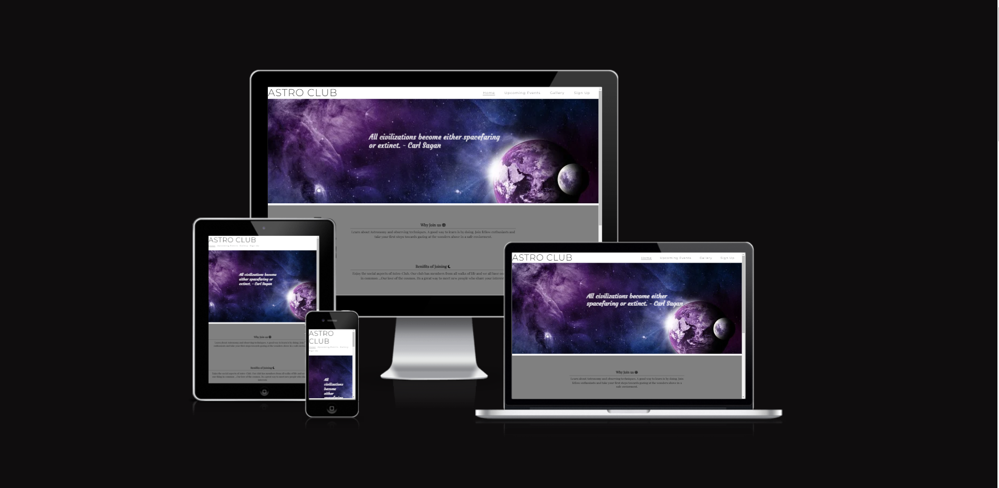
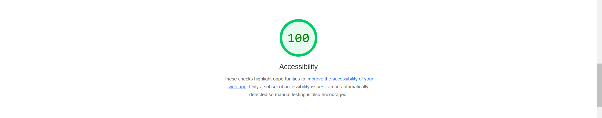

# Astro-club
This project was created for an Astronomy club where people can come together to learn and enjoy viewing space in a safe enviornment. This is a site that wants to bring people together so they can learn about and share they're love of space. Where if your unsure of what equipment to be using during your observations, you can come to our club to find out. We have a mentor programme. In this programme you are paired up with your more advanced peers. We also have an astro photography class where you learn to take pictures of space. This site is targeted toward people with an interest in space. The site is useful for people to see when and where classes and meetings will be taking place. There is also a sign up page for them to be able to join up and enjoy all the aspects our club has to offer. 

# Existing Features:
### Navigation bar:
This nav bar is on the top right of the site. From here you can go to the Home page, Gallery, Upcoming Events and Sign-up pages. This allows the user to navigate the site with ease.

### The home page:
 This page starts with a photo of space with quotes easing in and out in 25s intervals. The section underneath this page tells the user what the benefits are to joining and what the site is about. Underneath this is another photo with the times and places that our classes will be held at. It also mentions the photography class.

 

### The Footer: 
Here the user will be able to click recognisable icons that will link them to our various social media pages.

### Upcoming Events:
 This page will tell the user of special events taking place this month. For instance in September there is a meteor shower event. This is a wonderful chnace to learn more about your interests. These events take place outside the normal hours of our observing meet ups. So they are another great way to meet new people with similar interests.
 
 
### The gallery:
 The gallery shows images of our usual tagerts of observation. They have alt attributes attatched. They are images of the different planetary bodies we will be pointing our telescopes at.

### Sign-Up Page:
Here the user can enter their information and select any or all classes they would like to join.

## Feature for future implementation:
* In the fututre I would like to add another gallery page to showcase the astrophotography pictures our members have taken to show the kind of things you will learn in the class.
* A page to display the types of telescopes and equipment and what they are best suited to for observing purposes.

# Testing:
As I went threw this project which was writtem entirly in HTML/CSS I tested it by seeing what it looked like as a deployed website. I didnt come across many bugs when building this site. I will detail below what bugs I encountered.
* When creating the home page I had trouble getting a picture to stretch the entire width of the screen. To fix this I used the css code (background-size: cover;), once I entered this code I did not have any issues with my picture covering the width of the screen.

* When adding my media queries I did encounter an issue when I made my site 1200px and below, some of my text in the about section would spill out of the div when making the screen smaller but once I got down to 950px and below my text would spread out and stay in the container. So the issue was only with the first media query.
Unfortunatly I could not fix this so I removed some text to avoid the problem. In future updates I would like to fix this issue and add the text back in.

# Validator Testing:

* HTML:
    * One warning showed here when passing threw the official validator - (https://validator.w3.org/). The warning was to replace a 
    "section" container with a div or a heading. As i didnt need a heading here I chose to replace the section container with a div. When I put the code threw a second time there was no errors.

* CSS: 
    * There were no errors found when passing threw the offical validator - (https://jigsaw.w3.org/css-validator/)

# Deployment:
* The site was deployed to GitHub Pages. The steps to deploy are:
    * In the GitHub repository, click onto the Settings tab
    * From the source section drop-down menu, select the Master Branch
    * Once the master branch has been selected, the page will be automatically refreshed with a detailed ribbon display to indicate the successful deployment.

# Resubmission
* BUG FIXES:
    * Upon previous deployment a number of bugs where noticable relating to responsiveness for smaller screens. I completely rewrote and added more media queries to fix these issues and redeployed the site.

* COMMITS: I had a lack in number and quality of commits in my previous deployment of my webite. So for resubmission when fixingg my website i had the intention to demonstrate better version control practises and make more commits with improved commit messages.

* HTML VALIDATOR TESTING: For my feedback i was told to use semantic HTML so i changed some Divs to Sections however, upon retesting in the html validator i recieved two warnings on the Index.html and Gallery.html for not having headings in a section. I changed these back to Divs and then recieved no warnings. All HTML pages now pass HTML validating.

* Contrast: There is no contrast issues now on the Upcoming-events page.

The Live link to site is here - (https://stephaniemaf.github.io/astronomy-club/)

# Credits:
* [codepen](https://codepen.io/nucliweb/pen/OJXYwm) - Code i used to have my quotes ease in and out on home page.

## Content:
* The idea and code for my website was based of the love running project we did during class. Link here:
  (https://code-institute-org.github.io/love-running-2.0/index.html)
* The quotes I used for my home page picture I got from [Google Images](https://images.google.com/).
* My Icons where from [Font Awesome](https://fontawesome.com/)  
* The font families I used threw out the website I got from [Google Fonts](https://fonts.google.com/about)                  

## Media:
* The images I used where from three websites. Linked below:
    * [Pixabay](https://pixabay.com/)
    * [Pexels](https://www.pexels.com/)
    * [Google Images](https://images.google.com/)

